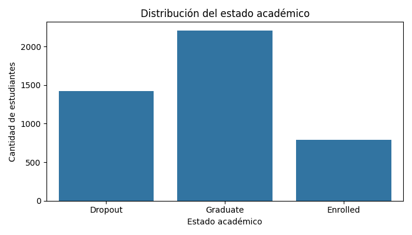
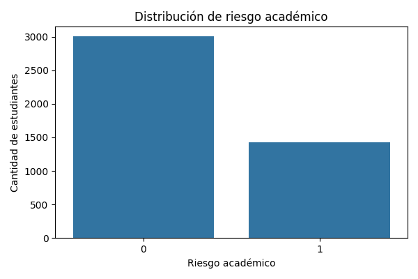
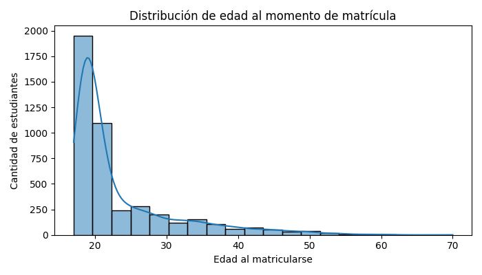
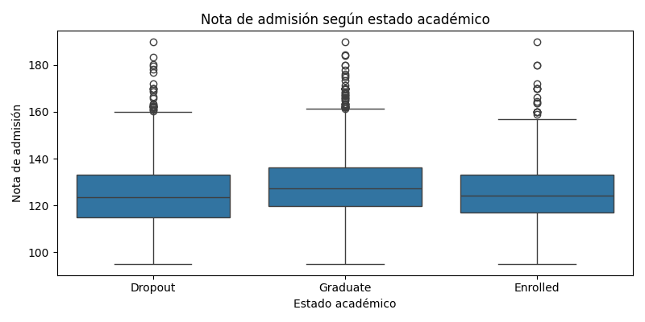
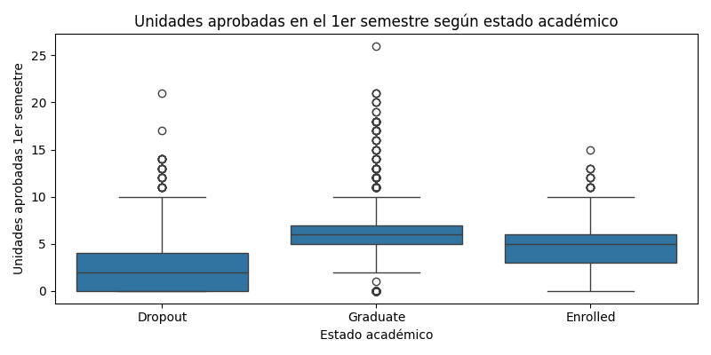
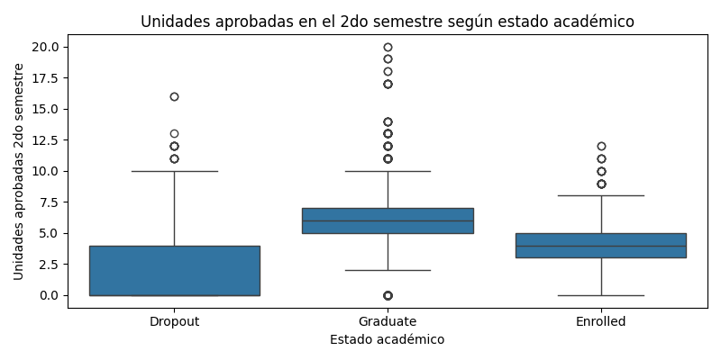
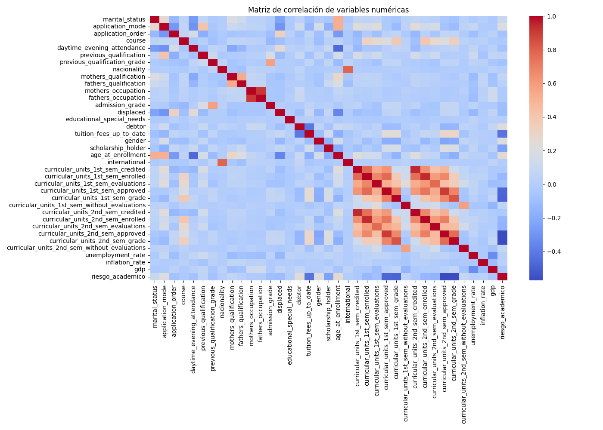

# 6. Resultados e Interpretación

## 6.1 Distribución del estado académico

La distribución del estado académico muestra que la categoría con mayor cantidad de registros corresponde a estudiantes graduados, seguida por estudiantes que abandonaron sus estudios y, finalmente, por estudiantes que continúan matriculados. Esto evidencia que el dataset presenta una representación adecuada de las tres situaciones académicas, permitiendo entrenar un modelo capaz de distinguir entre estudiantes con diferentes trayectorias educativas.

---

## 6.2 Distribución del riesgo académico

La variable objetivo binaria presenta un desbalance moderado. Los estudiantes clasificados como "sin riesgo académico" representan aproximadamente dos tercios del total, mientras que los estudiantes en riesgo constituyen alrededor de un tercio de la muestra. Esta distribución es adecuada para problemas de clasificación y permite entrenar modelos predictivos sin requerir técnicas avanzadas de balanceo.

---

## 6.3 Distribución de edad al momento de matrícula

La mayoría de los estudiantes ingresó a la institución entre los 18 y 22 años de edad. Sin embargo, existe una cola de distribución que se extiende hasta edades superiores a los 60 años. Esta característica indica que el dataset incluye tanto estudiantes tradicionales como estudiantes de mayor edad, lo que aporta diversidad a los patrones analizados por el modelo.

---

## 6.4 Nota de admisión según estado académico

Los estudiantes graduados presentan, en promedio, notas de admisión ligeramente superiores a las observadas en los grupos de abandono y matrícula. Aunque las distribuciones muestran cierto solapamiento, se observa una tendencia que sugiere que un mejor desempeño previo al ingreso puede estar asociado con una mayor probabilidad de culminar exitosamente los estudios.

---

## 6.5 Unidades aprobadas en el primer semestre

Las diferencias entre grupos son claramente visibles. Los estudiantes graduados aprobaron una mayor cantidad de unidades curriculares durante el primer semestre, mientras que los estudiantes que abandonaron presentan valores significativamente menores. Este comportamiento indica que el rendimiento académico temprano constituye un factor importante para identificar posibles casos de riesgo académico.

---

## 6.6 Unidades aprobadas en el segundo semestre

Se observa nuevamente una diferencia marcada entre los grupos. Los estudiantes graduados mantienen niveles elevados de aprobación de cursos, mientras que los estudiantes que abandonan muestran valores considerablemente más bajos. Esto confirma que el desempeño académico sostenido durante los primeros semestres es un indicador relevante para la predicción del abandono estudiantil.

---

## 6.7 Matriz de correlación

La matriz de correlación muestra relaciones fuertes entre las variables académicas asociadas a los resultados obtenidos en ambos semestres. Las variables relacionadas con cursos matriculados, evaluaciones realizadas, asignaturas aprobadas y calificaciones presentan correlaciones positivas elevadas. Asimismo, se observa una relación negativa entre algunas de estas variables y la variable de riesgo académico, lo que sugiere que un mejor desempeño académico disminuye la probabilidad de abandono.

---

# 6.8 Resultados del modelo predictivo

Las métricas obtenidas por el modelo Random Forest muestran un desempeño sólido en la identificación de estudiantes en riesgo académico. :contentReference[oaicite:0]{index=0}

| Métrica | Valor |
|----------|--------|
| Accuracy | 0.8847 |
| Precision | 0.8824 |
| Recall | 0.7394 |
| F1-Score | 0.8046 |
| ROC-AUC | 0.9320 |
| F1 Promedio CV | 0.7871 |

### Interpretación de métricas

- **Accuracy (88.47%)**: el modelo clasifica correctamente aproximadamente nueve de cada diez estudiantes.
- **Precision (88.24%)**: cuando el modelo identifica a un estudiante como de riesgo, la predicción es correcta en la mayoría de los casos.
- **Recall (73.94%)**: el modelo logra detectar cerca de tres cuartas partes de los estudiantes realmente en riesgo académico.
- **F1-Score (80.46%)**: existe un equilibrio adecuado entre precisión y capacidad de detección.
- **ROC-AUC (93.20%)**: el modelo posee una excelente capacidad para diferenciar estudiantes en riesgo y sin riesgo.
- **Validación Cruzada (78.71%)**: los resultados son consistentes y generalizables sobre diferentes particiones de los datos.

### Matriz de confusión

|               | Predicción: No Riesgo | Predicción: Riesgo |
|---------------|----------------------|-------------------|
| Real: No Riesgo | 573 | 28 |
| Real: Riesgo | 74 | 210 |

La matriz de confusión indica que el modelo identifica correctamente a la mayoría de los estudiantes en ambas categorías. Los errores de clasificación son relativamente bajos, lo que confirma la utilidad del modelo para apoyar la detección temprana de estudiantes con probabilidad de abandono.

---

# 7. Conclusiones

- Las variables académicas relacionadas con cursos aprobados y calificaciones obtenidas durante los primeros semestres son los factores más relevantes para explicar el riesgo académico.
- Los estudiantes que presentan menor rendimiento en los primeros ciclos muestran una probabilidad significativamente mayor de abandono.
- El modelo Random Forest alcanzó un desempeño satisfactorio, con una precisión superior al 88% y un ROC-AUC superior al 93%.
- Los resultados demuestran que es posible implementar sistemas de alerta temprana que permitan identificar estudiantes en riesgo y facilitar acciones de intervención académica.
- La integración de un dashboard interactivo facilita la interpretación de los resultados y el monitoreo continuo de los estudiantes.
